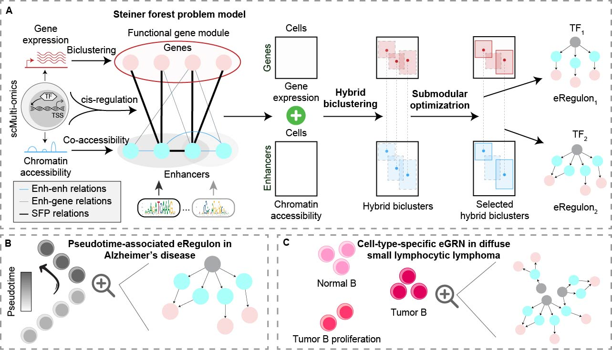
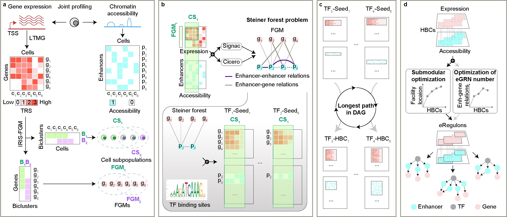

### STREAM: enhancer-driven gene regulatory networks inference from single-cell RNA-seq and ATAC-seq data



For detailed methodology of STREAM, please refer to the following figure:


Before installing STREAM, please ensure you have already installed QUBIC2 in your system by following 
[this tutorial](https://github.com/OSU-BMBL/QUBIC2).

You can install STREAM via below commands:
```R
# First, check and install the dependency packages using cran
cran_packages <- c("data.table", "dplyr", "ggplot2", "igraph", "Matrix", 
                   "pbapply", "qgraph", "RColorBrewer", "RCurl", "Ryacas",
                   "easypackages", "enrichR", "pbmcapply", "qualV",
                   "scales", "stats", "utils"
                   )

to_install_cran <- cran_packages[!sapply(cran_packages, requireNamespace, quietly = TRUE)]
if (length(to_install_cran) > 0) {
    install.packages(to_install_cran)
}


# Second, check and install BiocManager has been installed
if (!requireNamespace("BiocManager", quietly = TRUE))
    install.packages("BiocManager")


# Third, check and install the dependency packages by BiocManager
bioc_packages <- c("AnnotationDbi", "BSgenome", "BSgenome.Hsapiens.UCSC.hg19", "BSgenome.Hsapiens.UCSC.hg38", 
                   "BSgenome.Mmusculus.UCSC.mm10", "EnsDb.Mmusculus.v79", "EnsDb.Hsapiens.v75", 
                   "EnsDb.Hsapiens.v86", "biomaRt", "ensembldb", "GenomeInfoDb", "GenomicAlignments", 
                   "GenomicRanges", "JASPAR2022", "motifmatchr", "Repitools", "regioneR", 
                   "rTRM", "SingleCellExperiment", "STRINGdb", "SummarizedExperiment", 
                   "IRISFGM", "simpIntLists", "TFBSTools", "dorothea"
                   )

to_install_bioc <- bioc_packages[!sapply(bioc_packages, requireNamespace, quietly = TRUE)]
if (length(to_install_bioc) > 0) {
    BiocManager::install(to_install_bioc)
}


# Fourth, check and install devtools
if (!requireNamespace("devtools", quietly = TRUE))
    install.packages("devtools")


# Fifth, check and install the dependency packages by devtools
github_packages <- c( 
                     "mskilab-org/gUtils",  
                     "cole-trapnell-lab/monocle3", 
                     "satijalab/Seurat", 
                     "satijalab/Signac", 
                     )

# Extracting package names from GitHub paths
package_names_github <- sapply(strsplit(github_packages, "/"), `[`, 2)

to_install_github <- github_packages[!sapply(package_names_github, requireNamespace, quietly = TRUE)]
if (length(to_install_github) > 0) {
    devtools::install_github(to_install_github)
}


# Sixth, install STREAM
devtools::install_github("OSU-BMBL/STREAM")
```

We provided the following tutorials to show how to use STREAM to build enhancer regulons (eRegulons) and enhancer-driven 
gene regulatory networks (eGRNs) by using single-cell multiomics/multimodal data:

* [Simulated data analyses](https://osu-bmbl.github.io/STREAM/articles/data-simulation.html)

* [Biological data analyses](https://osu-bmbl.github.io/STREAM/articles/eRegulon-inference.html)


Please consider citing our paper if you used STREAM:
```
@article{li2024stream,
  title={Enhancer-driven gene regulatory networks inference from single-cell RNA-seq and ATAC-seq data},
  author={Li, Yang and Ma, Anjun and Wang, Yizhong and Guo, Qi and Wang, Cankun and Fu, Hongjun and Liu, Bingqiang and Ma, Qin},
  journal={Briefings in Bioinformatics},
  volume={0},
  number={0},
  pages={0},
  year={2024},
  publisher={Oxford University Press}
}
```

